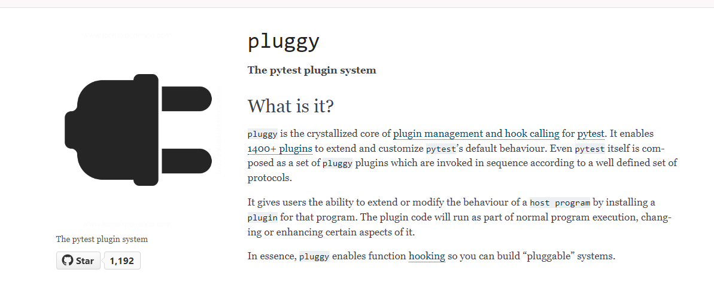

# Asides

## What are asides?

Asides are articles on useful aspects of PyTest Full Stack but are not part of a PyTest Full Stack Run.

For example, we have a folder `docker` that is integrated into PFS, but we also have an isolated set of docker tests that would need to be run in a separate and isolated environment with elements of PFS added in. 

Essentially the converse of what we are doing in PFS.

An example is tests/_isolated_suites which has a docker-postgres-fixtup suite.

## Pluggy

Pytest uses Pluggy to have a plugin architecture.

Using Pluggy docs, I have created a repo andd video of the examples in the docs as well as extend it to include two plugins rather than just one.

## Mocking

This covers mock, patch and monkeypatch using Rich and PyBoxed for pretty console output. We look at globals() and sys.modules to see what is happening under the hood as well as create our own mocks to better understand this topic.

 

