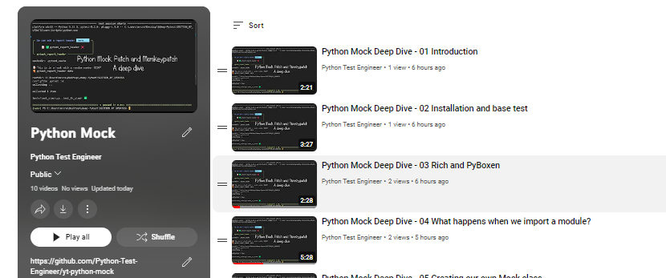
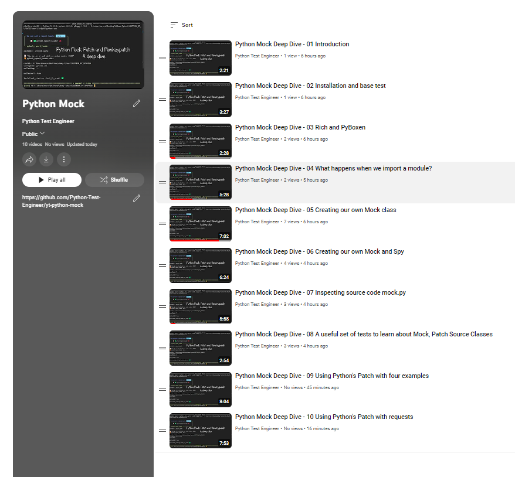

# Python Mock, Patch and Monkeypatch

## About

I have created a repo and video series to dive deeper into what mock, patch and monkeypatch do behind the scenes.

Using Rich and PyBoxen for pretty console output, we look at globals() and sys.modules to see how we can create our own mocks and patches.

We will also look at the source code for `mock.py` as well as look at a number of template examples that I have collected from various named sources.

The hardest part is 'getting' the wiring so it is best to work with the repo and break and fix the tests to really understand that patching involves using `where it is called, not where it is defined'.

Regardless, these act as templates and with use the wiring will become clearer.

The repo is [here](https://github.com/Python-Test-Engineer/yt-python-mock) and the YT video series is [here](https://www.youtube.com/playlist?list=PLsszRSbzjyvlLRuCuj0KqZzEBEHK0_H7g) with the remaining videos uploaded by the end of JUL2024.

I have endeavoured to make the repo heavily commented so that it can be used as an 'ebook'.

 