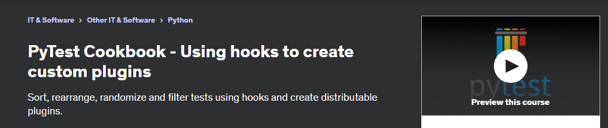

# Learning PyTest - Suggested path

I have made some videos to assist in using this PyTest Cookbook and how to customise the hooks and plugins used to create custom terminal reports and custom CSV files.

These videos are available [here](https://www.youtube.com/playlist?list=PLsszRSbzjyvlrB6V5dacW6G8YrD_iW7oy){target="_blank"}.

## 1. CoffeeBeforeArch 

Located in `02_py_coffee` in PFS, this is a great video series on PyTest. I have included the tests form his repo as part of the template tests. Links in repo.

[CoffeeBeforeArch](https://www.youtube.com/playlist?list=PLxNPSjHT5qvuZ_JT1bknzrS8YqLiMjNpS)

## 2. Indian Pythonista

Located in `03_indian_pythonista` in PFS, this is another great video series that has source code included.

[Indian Pythonista](https://www.youtube.com/playlist?list=PLyb_C2HpOQSBWGekd7PfhHnb9GnqDgrxS)

## 3. PyTest with Eric

This is perhaps one of the best resources for PyTest, [PyTestWithEric](https://pytest-with-eric.com/), I am creating videos of them and incorporating the GitHub code to provide a second content delivery medium, explaining salient points.

This is both for my own technical development and a way of creating a greater audience for this body of work.

I have started recording videos of me go through the article and adding them to PyTest Full Stack in 60_pwe.

Playlist [PyTest With Eric](https://www.youtube.com/playlist?list=PLsszRSbzjyvm5meFiH-rDU-YiC5kcOLcK)

Articles videod:

- 01 pytest-html
- 02 suppress warnings
- 03 read yaml files with argparse and typer and test
- 04 transactions with SQL Model
- 05 setting up allure reporting
- 06 automated testing with GitHub actions

## 4. Hooks and Plugins

For an advanced look at these topics, I have my course hosted on Udemy:

The course is available [Udemy Hooks and Plugins course](https://www.udemy.com/course/pytest-cookbook-using-hooks-to-create-custom-plugins/) and Udemy has a sale ever two weeks and the cost would be $20 USD approx.

