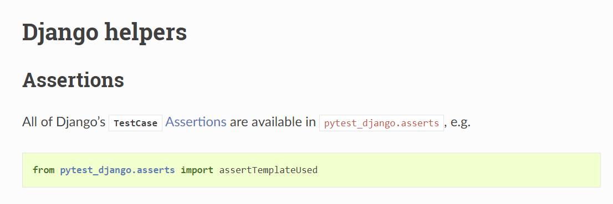
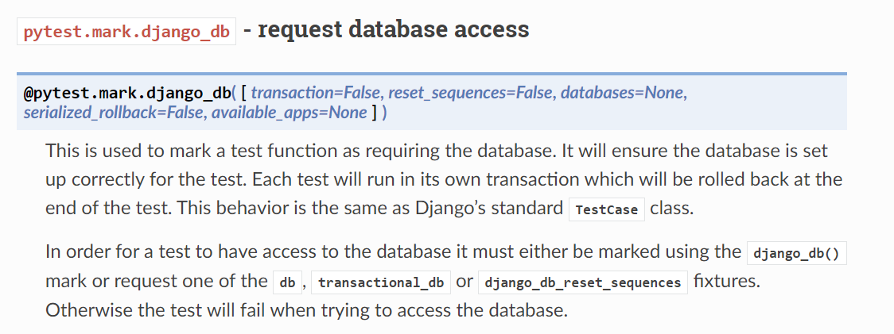
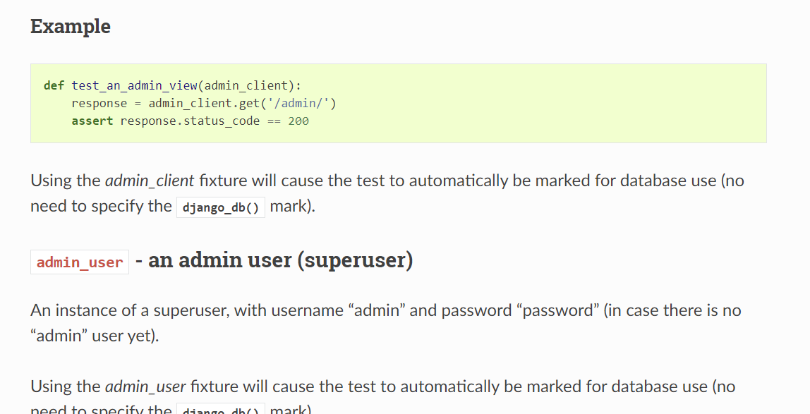
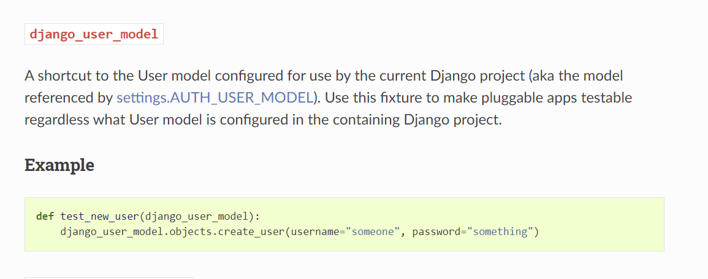
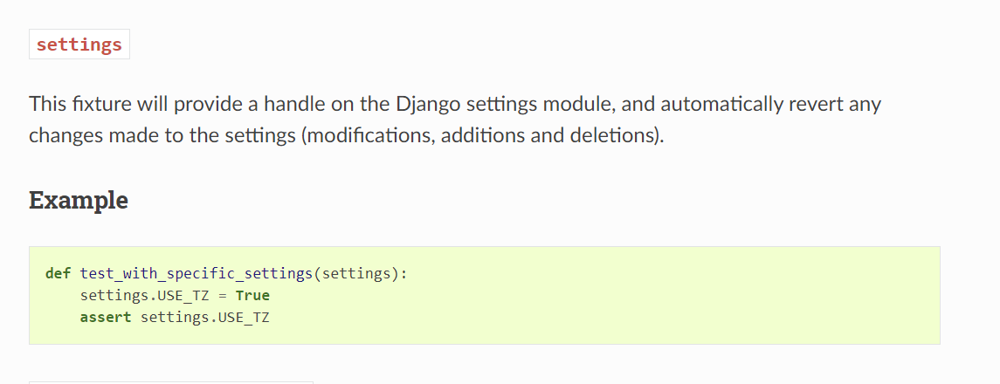
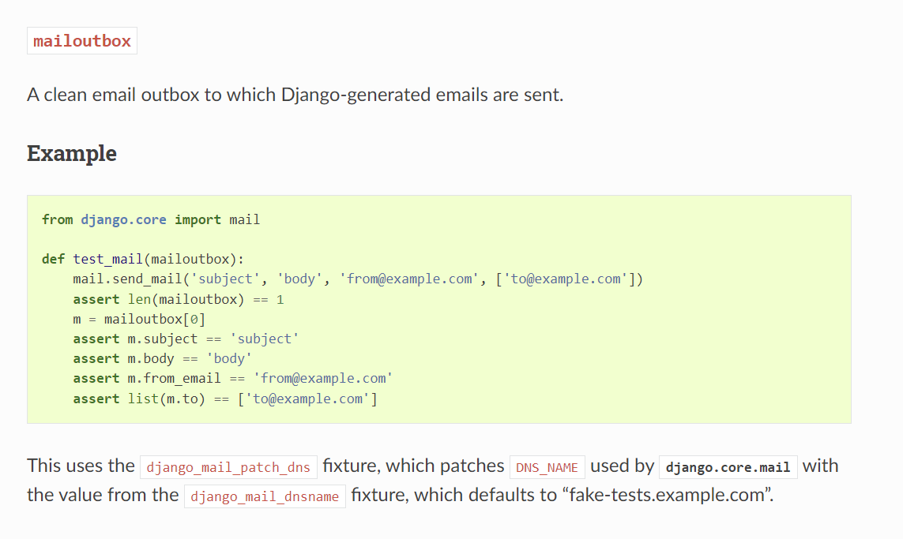

# PyTest-Django

## PyTest vs TestCase

When we use PyTest, (and PyTest-Django), we have all the functionality of TestCase as PyTest is built on top of it.

We have the option to use both test libraries.

## Assertions

Whilst PyTest uses `assert` rather than say, `assertEqual`, PyTest-Django allows us to use all the assertions from TestCase:



[https://pytest-django.readthedocs.io/en/latest/helpers.html](https://pytest-django.readthedocs.io/en/latest/helpers.html)

```
import pytest
from pytest_django.asserts import assertTemplateUsed

...

def test_should_use_correct_template_to_render_a_view(client):
    response = client.get('.../your-url/')
    assertTemplateUsed(response, 'template_name.html')
```

## Use of DB



In TestCase, we can use the SimpleTestCase when a DB is not required. This can speed up tests.


## Admin User Model



[https://pytest-django.readthedocs.io/en/latest/helpers.html#id5](https://pytest-django.readthedocs.io/en/latest/helpers.html#id5)

## User Model



[https://pytest-django.readthedocs.io/en/latest/helpers.html#django-user-model](https://pytest-django.readthedocs.io/en/latest/helpers.html#django-user-model)

## Settings



[https://pytest-django.readthedocs.io/en/latest/helpers.html#settings](https://pytest-django.readthedocs.io/en/latest/helpers.html#settings)


## Mailbox



[https://pytest-django.readthedocs.io/en/latest/helpers.html#mailoutbox](https://pytest-django.readthedocs.io/en/latest/helpers.html#mailoutbox)

<br>