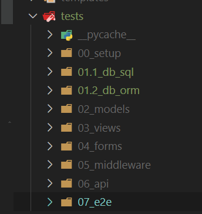

# Set up

## Clone Test Suite

Clone the repo: [https://github.com/Python-Test-Engineer/PyTest-Django-Full-Stack](https://github.com/Python-Test-Engineer/PyTest-Django-Full-Stack)

Create a virtual environment and activate:

- `python -m venv venv`
- `.\venv\Scripts\activate`
- `pip install -r requirements.txt`
- `playwright install` to load in Playwright browsers
- `python -m pytest -vvvs` will run all the tests in a very verbose mode and one will see the DB etc being set up as part of `pytest-django`.

## How it was built

`pytest-django` installs `pytest`.

`playwright` used for E2E. Please note after installing `playwright` run `run playwright install` to load browsers.

`pytest-playwright`

`django-extensions` is a utility we use. It is optional. The app needs to be installed in `settings.py`:

```

INSTALLED_APPS = [
...
'django_extensions',
...
]
```

`rich` and `pyboxen` are used for console output.

`factory-boy` (installs `Faker`) for data generation.

There is both a requirements.txt that lists the libraries needed at a top level, and a requirments_JUL2024.txt that has a `pip freeze` of all the libraries that got installed.

## Add pytest.ini

Add to pytest.ini

`DJANGO_SETTINGS_MODULE = studybud.settings` where `studybud` is name of root app where settings.py resides.

## Add log folder 

*Optional*

`pytest.ini` is configured to set up logging to `log` in the root of the project as well as custom formatting. Change to suit.. 

## Config setup

*Optional*

This is a convenience utility and not required.

The `config` folder and `utils/read_config.py` can be used to read config settings in the config folder.

We use this to load settings when we test APIs and E2E.

## Remove tests.py

To avoid conflicts that I have encountered, remove all tests.py files in any apps and use a tests folder to hold test files, either in one central folder in the project or in the apps themselves.

As the focus of this project is testing rather than the apps, I felt it was of more use to have all the tests with all the sub folders for areas of testing in one location.



## Test set up

Run `python -m pytest -vs tests/00_setup` and all tests in `tests/00_setup` folder should pass for setup, logging and config. This will ensure the framework is wired up correctly.

Logging will register some events.

`read_config.py` should also pass.

<br>