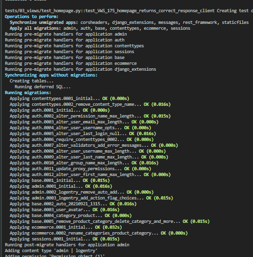

# Overview

## CLI

`-p no:logging` stops console logging.

This can be added as an `addopts` in the `pytest.ini` file to be a default.

```
addopts = 
    --strict-markers 
    -p no:warnings
    -p no:logging
```

## -vvv

This is the highest level of verbosity `-vvv` and will show us how migrations and permissions are set for a test when using the DB:



